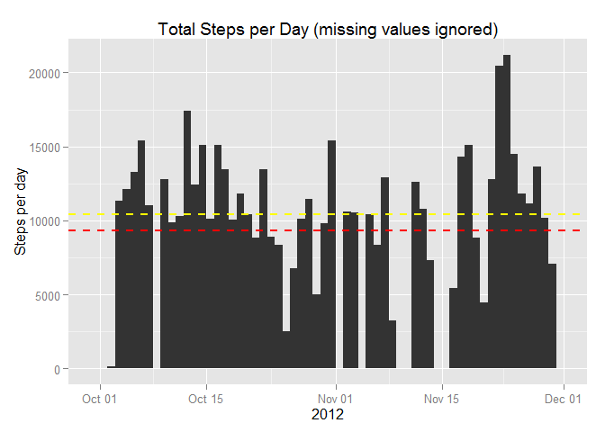
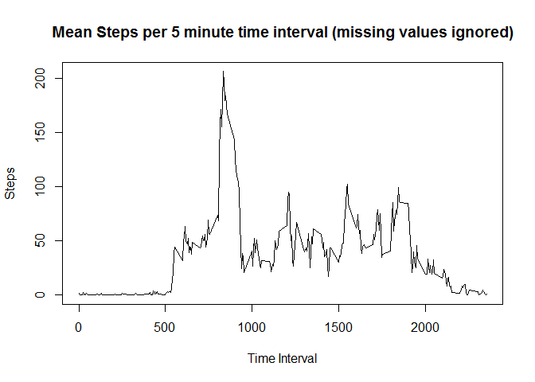
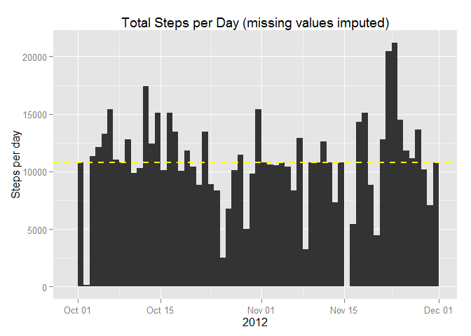
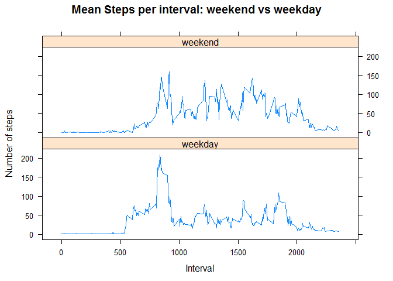

# Reproducible Research: Peer Assessment 1

---
title: "Peer Assessment Project 1: Reproducible Research"  
author: "Susan Z Martin"   
date: "Wednesday, February 14, 2015"       
---


```r
knitr::opts_chunk$set(echo = TRUE)
options("scipen"=100, "digits"=2)
```


### Introduction

It is now possible for 'average people' (albeit those that live in high income countries such as the United States, Canada, western European countries and Japan) to use commercially available and relatively inexpensive devices (Jawbone Up or Fitbit which retail for between $100-$200 US depending on model) to record daily activities like walking, jogging and cycling. This monitoring is of interest to those that are concerned about their personal health and fitness as well as to those who are just curious about the patterns that make up their daily lives.   

This document details exploratory analysis of such personal activity monitoring data collected by an anonymous participant over two months in 2012 (October and November). The data collected was the number of steps taken in 5 minute intervals throughout each of the 61 days in this period.

#### The Data

The data used for this project is publicly available as a [zipped file](https://d396qusza40orc.cloudfront.net/repdata%2Fdata%2Factivity.zip) of 53KB in size. Note that the zipped file is also available within this [GitHub repository](https://github.com/SusanZMartin/RepData_PeerAssessment1). The data used for this project was downloaded on February 6, 2015. Once unzipped the data consists of a file called activity.csv which is a 343KB file of comma-separated values (CSV). There are 17,568 observations in this file and three variables:

* __steps__ - an integer that represents the number of steps recorded by the monitoring device in a 5-minute interval
* __date__ - a character string that represents the date in October or November 2012 during which the activity was recorded
* __interval__ - an integer that represents the interval as number of minutes elapsed since midnight (00 hours) in increments of 5 for 24 hours - this number does not increase in usual mathematical fashion but goes only to 55 and then resets - thus the first sequence of intervals is 0, 5, 10, 15, 20, 25, 30, 35, 40, 45, 50, 55, 100

#### Data Quality    

There are missing values in the **steps** variable - these are indicated by an NA. Other quality issues will be discussed later in the document.  

### Loading and Pre-processing the Data

After unzipping the downloaded file into the working directory the following code reads the data into a data frame. Note that for this code to execute correctly the file must be named activity.csv and it must be in the working directory.


```r
activity <- read.csv("activity.csv", stringsAsFactors = FALSE )
```

Various packages will be used for pre-processing the data, basic analysis and the creation of plots. To ensure these packages are available the following code should be executed.


```r
library(dplyr)
```

```
## 
## Attaching package: 'dplyr'
## 
## The following object is masked from 'package:stats':
## 
##     filter
## 
## The following objects are masked from 'package:base':
## 
##     intersect, setdiff, setequal, union
```

```r
library(lubridate)
library(ggplot2)
library(lattice)
```

As mentioned earlier the **date** variable is a character string and needs to be processed into a properly formatted R object of 'date' class.


```r
activity <- mutate(activity, date = as.Date(date))
```

There will be a requirement in the analysis to look at weekday versus weekend activity levels so a column that represents the day of the week is created and added to the data frame.


```r
activity <- mutate(activity, weekday = wday(date, label=TRUE))
```
### Analysis of Steps per Day (ignoring missing values)


```r
## calculate total steps for each day and store in new data frame

newactivity <- group_by(activity, date)
totalstepsperday <- summarise(newactivity, totalspd = sum(steps, na.rm = TRUE))

## determine mean and median steps per day 

meanspd <- round(mean(totalstepsperday$totalspd), digits = 0)
medianspd <- median(totalstepsperday$totalspd)

## create histogram of total steps per day

qplot(date, data=totalstepsperday, weight=totalspd, geom="histogram", binwidth=1, main = "Total Steps per Day (missing values ignored)", xlab = "2012", ylab = "Steps per day") + geom_hline(aes(yintercept=meanspd), colour="red", linetype="dashed", lwd = 1) + geom_hline(aes(yintercept=medianspd), colour="yellow", linetype="dashed", lwd = 1) 
```

 


The plot above shows the total number of steps per day for each of the 61 days within the monitoring period. Note that for this histogram missing values were ignored. The mean number of steps per day is 9354 (represented by the red dashed line on the histogram) while the median is 10395 (represented by the yellow dashed line on the histogram).

##Analysis of Steps per Interval (ignoring missing values)


```r
## group by interval

 newdailyactivity <- group_by(activity, interval)

## get total steps per interval, mean steps per interval

totalstepsperint <- summarise(newdailyactivity, totalspi = sum(steps, na.rm = TRUE))
 
meanstepsperint <- summarise(newdailyactivity, meanspi = mean(steps, na.rm = TRUE))


## which is the interval with the highest number of steps

ordered <- arrange(meanstepsperint, desc(meanspi))
highest <- round(ordered[1,2], digits =0)
inthigh <- ordered[1,1]
```

The line plot below shows the mean steps per 5 minute interval within a 24-hour period (averaged across the 61 days in the monitoring period). Note that missing values are ignored in this analysis.


```r
plot(meanstepsperint$interval, meanstepsperint$meanspi, type = "l", xlab = "Time Interval", main = "Mean Steps per 5 minute time interval (missing values ignored)", ylab = "Steps")
```

 

The plot above shows the mean number of steps per interval for each of the 288 intervals within a 24-hour day (averaged over the 61 days in the monitoring period). Again missing values have been ignored in this analysis. The interval with the highest average number of steps across all days is interval 835 (which corresponds to 8:35 am) with a value of 206 steps.


## Imputing missing values and repeating analysis


```r
summary(activity)
```

```
##      steps           date               interval     weekday    
##  Min.   :  0    Min.   :2012-10-01   Min.   :   0   Sun  :2304  
##  1st Qu.:  0    1st Qu.:2012-10-16   1st Qu.: 589   Mon  :2592  
##  Median :  0    Median :2012-10-31   Median :1178   Tues :2592  
##  Mean   : 37    Mean   :2012-10-31   Mean   :1178   Wed  :2592  
##  3rd Qu.: 12    3rd Qu.:2012-11-15   3rd Qu.:1766   Thurs:2592  
##  Max.   :806    Max.   :2012-11-30   Max.   :2355   Fri  :2592  
##  NA's   :2304                                       Sat  :2304
```

```r
howmany <- sum(is.na(activity))
```


```r
zeros <- nrow(filter(activity, steps == 0))
```

There are 2304 missing values (those with an NA as their value) in the dataset (found only in the steps variable) or approximately 13% of the observations. Note that a summary (see above) and the filtering of the data where steps are equal to zero indicates that there are many intervals with questionable data. A data frame created by extracting only those rows where **steps** equals zero contains 11014 rows (or 62.7% of all observations). Even if we consider the hours between midnight and ~0800 hours to be likely to have no/few steps (because the person is sleeping) this would only account for 33% of the observations leaving us with what seems to be a large amount of potentially unreliable observations. However, the instructions for imputation were only to replace missing (NA) values not to address these other possible gaps in the data. 

#### Rationale for imputation values chosen  


```r
## create two data frames representing different times of day

night <- filter(newdailyactivity, interval <= 600)

day <- filter(newdailyactivity, interval > 600)

nighttime <- round(mean(night$steps, na.rm = TRUE), digits=2)
daytime <- round(mean(day$steps, na.rm = TRUE), digits = 2)
```

By examining the summary of the data frame and also by visually examining the line plot created in the previous section it can be seen that on average the first several hours of each day typically have few steps per interval. Thus it was decided to have two imputation values. To arrive at the imputation values the data frame was split into two (intervals =< 600, intervals > 600) and the mean for steps taken for each time period (midnight to 6:00 am, 6:05 am to 11:55 pm).  

The mean for 'nighttime' intervals (midnight to 6:00 am) was 2.88 steps per interval and for 'daytime' intervals (6:05 am to 11:55 pm) it was 49.1 steps per interval. These numbers were rounded to 3 and 49 for imputation.

### Imputation process  

A new dataset was created with the imputed values replacing the NAs.


```r
## create new data set with imputation values chosen

imputeddf <- newdailyactivity


i <- 1

for(i in 1:17568) {
     

if(is.na(newdailyactivity[i,1]) & newdailyactivity[i,3] <= 600) imputeddf[i,1] <- 3

if(is.na(newdailyactivity[i,1]) & newdailyactivity[i,3] > 600) imputeddf[i,1] <- 49


}
```

### Repeating analysis of steps per day with dataset with imputed values replacing NAs


```r
## calculate total steps for each day and store in new data frame

impactivity <- group_by(imputeddf, date)
impstepsperday <- summarise(impactivity, imptotalspd = sum(steps, na.rm = TRUE))

## determine median and mean steps per day 

impmeanspd <- mean(impstepsperday$imptotalspd)
impmeanspd <- round(impmeanspd, digits = 0)

impmedianspd <- round(median(impstepsperday$imptotalspd), digits = 0)

## create histogram of total steps per day

qplot(date, data=impstepsperday, weight=imptotalspd, geom="histogram", binwidth=1, main = "Total Steps per Day (missing values imputed)", xlab = "2012", ylab = "Steps per day") + geom_hline(aes(yintercept=impmeanspd), colour="red", linetype="dashed", lwd = 1) + geom_hline(aes(yintercept=impmedianspd), colour="yellow", linetype="dashed", lwd = 1) 
```

 

The plot above shows the total number of steps per day for each of the 61 days within the monitoring period where the missing values have been replaced with imputed values. The mean number of steps per day is now 10765 (versus 9354 in the previous histogram) and is represented by the red dashed line. The median number of steps per day is now 10754 (versus 10395 in the previous histogram) and is represented by the yellow dashed line. Note that because of the closeness of the mean and median values it is difficult to see the lines indicating them on the histogram but they are both there.

The new mean and median values for total steps per day have increased by 15% and 3% respectively. This seems like quite a reasonable change given the percentage of observations (13%) that were missing values.

## Examination of activity patterns between weekends and weekdays

This section examines whether there is a difference between activity patterns on weekdays (Monday through Friday) versus weekends (Saturday and Sunday). The dataset with the imputed values was used for this analysis. The resulting panel plot demonstrates that typically this individual was a bit slower to ramp up their activities on weekends versus weekdays but that variability between intervals was actually lower on weekends and steps per interval were higher on average than during the week. 


```r
## create factor variable and cbind to existing data set

j <- 1
daytype <- vector(mode = "character")


for(j in 1:17568) {
      
      
      if(imputeddf[j,4] == "Sat" | imputeddf[j,4] == "Sun") daytype[j] = "weekend"
      
      else daytype[j] = "weekday"
      
      
}

## add column to the imputed data frame

imputeddf <- cbind(imputeddf, daytype)
```


```r
daytypeintact <- group_by(imputeddf, daytype, interval)
sumstepsintdt <- summarise(daytypeintact, sumspd = sum(steps))

## create two data sets one of weekend intervals, one of weekday intervals

intweekends <- filter(sumstepsintdt, daytype == "weekend")
intweekends <- mutate(intweekends, avthisint = sumspd/16)
totalspdwkend <- trunc(sum(intweekends$sumspd)/16)

intweekdays <- filter(sumstepsintdt, daytype == "weekday")
intweekdays <- mutate(intweekdays, avthisint = sumspd/45)
totalspdwkday <- trunc(sum(intweekdays$sumspd)/45)

## rbind two data sets together

allintervals <- rbind (intweekdays, intweekends)

## create panel plot

xyplot(avthisint ~ interval | daytype, data = allintervals, type = "l", xlab = "Interval", ylab = "Number of steps" , layout = c(1,2), main = "Mean Steps per interval: weekend vs weekday")
```

 

Analysis shows that there was a 19% higher mean number of steps per day on the weekends than on the weekdays (12200 versus 10254 respectively).
